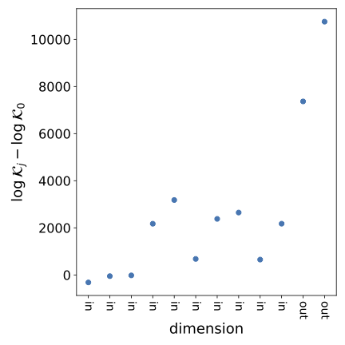
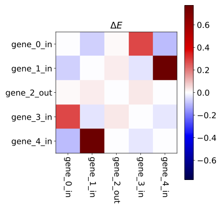

# Bayesian data selection
This repo provides example code implementing Bayesian data selection with the "Stein volume criterion (SVC)", as introduced in the paper

> Bayesian data selection, Eli N. Weinstein and Jeffrey W. Miller, 2021

## Installation

Download this repo, create a new python 3 virtual environment (eg. using conda), and run

    pip install .

To test your installation, navigate to the `svc` subfolder and run

    pytest

## pPCA

To perform data selection on a probabilistic PCA model, using the fast linear approximation described in the paper, navigate to the `svc` subfolder and run

    python pPCA.py example_pPCA.cfg

A detailed description of the model's options and how to input your own data can be found in the config file `example_pPCA.cfg`.

Results will (by default) be put in a time-stamped subfolder within the results
folder. Below is an example output plot based on simulated data showing the SVC difference (with ) for each data dimension. Dimensions marked "out" are those over which the model is misspecified, and we see that the SVC difference is, appropriately, larger over those dimensions.

## Glass

To perform data selection on the glass model of gene expression data described in the paper, using a variational approximation to the SVC and the LOORF estimator, navigate to the `svc` subfolder and run

    python RNAGlass.py example_RNAGlass.cfg

A detailed description of the model's options and how to input your own data can be found in the config file `example_RNAGlass.cfg`.

Results will (by default) be put in a time-stamped subfolder within the results
folder. Below is an example output plot based on simulated data showing which data dimensions are included (selection probability close to 1) and which are excluded (selection probability close to 0) by the stochastic data selection procedure. The dimension marked "out" has more severe misspecification than the others, and it is, appropriately,
deselected.

The below plot shows the learned foreground model parameters. Note the simulated data is designed to have negative correlation between dimensions 0 and 3, and between dimensions 1 and 4.

